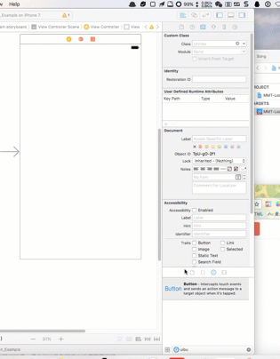

# SWTextAndImageButton

[](https://travis-ci.org/i_songwei@163.com/SWTextAndImageButton)
[](http://cocoapods.org/pods/SWTextAndImageButton)
[](http://cocoapods.org/pods/SWTextAndImageButton)
[](http://cocoapods.org/pods/SWTextAndImageButton)

## Example

To run the example project, clone the repo, and run `pod install` from the Example directory first.

## Requirements

## Installation

SWTextAndImageButton is available through [CocoaPods](http://cocoapods.org). To install
it, simply add the following line to your Podfile:

```ruby
pod 'SWTextAndImageButton', '~>0.0.4'
```

## Use

```
code
SWTextAndImageButton * btn
btn.rectType =SWButtonTypeTextLeft;  //方向
btn.contentDistance = 10; // 文字图片间的距离
btn.padding = 20; // 边距
```

xib


## Author

i_songwei@163.com, i_songwei@163.com

## License

SWTextAndImageButton is available under the MIT license. See the LICENSE file for more info.
